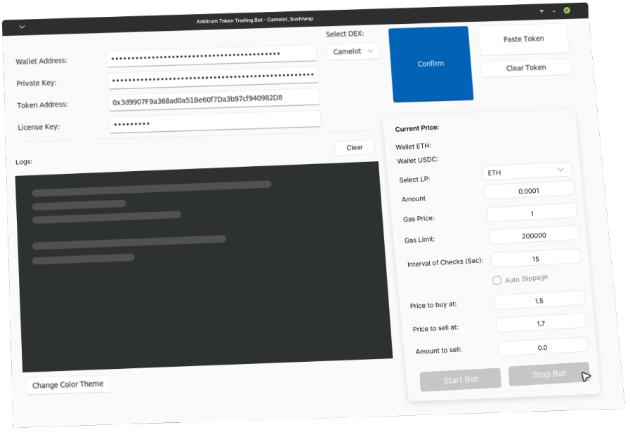

<div align="center">
  
  <h1>ZEUS TOKEN TRADING BOT</h1>
  <h2>Can be also used as a Volume Making Bot for your token o.o</h2>
  <h3>Arbitrum is the best chain for trading because it's impossible to frontrun anything</h3>
  <p>Trading ANY token pair automatically, HIGHLY requested</p>
  <p align="center">
</p>

<p align="center">
  
  
  
</p>
  
  <p>If you want a sniping bot instead: https://github.com/DeFiMasterd/PancakeX-ASTRA-V2-BSC-Sniping-Bot</p>
  <p>Our website: https://defix.app</p>
 
  [](https://opencollective.com/fakerjs#section-contributors)
  [](https://opencollective.com/fakerjs)
  
</div>

## 💎 This is how the GUI looks (pretty sexy huh)



## 🚀 Features
- 💌 Automatic trading of ANY token on Sushiswap and Camelot (HELL YEAH!)
- ⏰ Token that is highly volatile really makes a lot of money with this
- 🌏 Set exact price to buy at and sell at! Consistent results
- 💸 Custom gas price and limit
- 💸 Dark Mode
- Enjoy and leave a star, if you like it!

> **Note**: Please install a code tool first, such as Visual Studio Code as it will help you set up this bot within 5 minutes

## 📦 Install


1. Download python3+ for your PC from python org
2. Open terminal in the bot folder and type ```pip3 install -r requirements.txt``` / this will install all modules required to run the bot
3. In the same terminal type ```python3 zeus.py```


## 🤝 Sponsors

PancakeX is an MIT-licensed open source project with its ongoing development made possible entirely by the support of these awesome backers

## 📘 Credits

Thanks to all the people who already contributed to making this PancakeX better!


## 📝 Changelog

Detailed changes for each release:

#### • Version v1 [release] - 2 months ago
#### • Version v2.2 [added 9 new functions, GUI release] - 1 month ago
#### • Version v2.3 [fixed minor bugs] - 4 weeks ago
#### • Version v2.4 [minor changes] - 3 weeks ago
#### • Version v3 [ADDED DARK MODE] - 2 days ago

## 🔑 License

[MIT]
